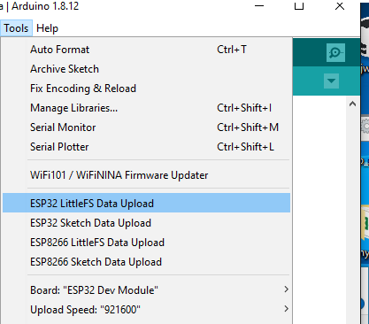

# arduino-esp32littlefs-plugin
## Arduino ESP32 LittleFS filesystem uploader 

- Arduino plugin, which packs sketch <b>data</b> folder into LittleFS filesystem image and uploads the image to ESP32 flash memory
- Everything is kept identified as SPIFFS for compatibility with your previous code like drop-in replacement
- Same partition scheme and "data" folder is used
- You can use either LITTLEFS or SPIFFS but not both simultaneously on given Arduino project
- Find my LITTLEFS library for arduino-esp32 core [here](https://github.com/lorol )

## Installation

- Make sure you use one of the supported versions of Arduino IDE and have ESP32 core installed.
- Download the tool archive from [here](https://github.com/lorol )
- In your Arduino sketchbook directory, create tools directory if it doesn't exist yet.
- Unpack the tool into tools directory (the path will look like ```<home_dir>/Arduino/tools/ESP32LittleFS/tool/esp32littlefs.jar```).
- You need [mklittlefs tool](https://github.com/earlephilhower/mklittlefs)  Download the [release](https://github.com/earlephilhower/mklittlefs/releases) and copy it to 
packages\esp32\tools\mkspiffs\<mklittlefs rev. x.x.x>\ or on checkout (dev) environment to: packages\esp32\hardware\esp32\<release>\tools\mklittlefs\
- Restart Arduino IDE. 

On the OS X create the tools directory in ~/Documents/Arduino/ and unpack the files there

## Usage

- Open a sketch (or create a new one and save it).
- Go to sketch directory (choose Sketch > Show Sketch Folder).
- Create a directory named `data` and any files you want in the file system there.
- Make sure you have selected a board, port, and closed Serial Monitor.
- Select *Tools > ESP32 LittleFS Data Upload* menu item. This should start uploading the files into ESP32 flash file system.

  When done, IDE status bar will display LITTLEFS Image Uploaded message. Might take a few minutes for large file system sizes.
  
## Screenshot



## Credits and license

- This work is based on the [original tool](https://github.com/me-no-dev/arduino-esp32fs-plugin/ ) Copyright (c) 2015 Hristo Gochkov (hristo at espressif dot com)
- Licensed under GPL v2 ([text](LICENSE))
- ESP8266 variant of same tool, made by [<b>earlephilhower</b> is here](https://github.com/earlephilhower/arduino-esp8266littlefs-plugin)
- ESP8266 variant of LittleFS libraty, same author: [see here](https://github.com/esp8266/Arduino/tree/master/libraries/LittleFS)

## Quick building on Win:

- Install Java JDK 
- Find the path of javac.exe and jar.exe
- Edit make_win.bat accordingly
- Copy files <b>arduino-core.jar , commons-codec-1.7.jar , pde.jar</b>  from your Arduino IDE installation to the folder where is located <b>make_win.bat</b>
- Run <b>make_win.bat</b>
- Find the <b>build jar</b> in /bin directory 
